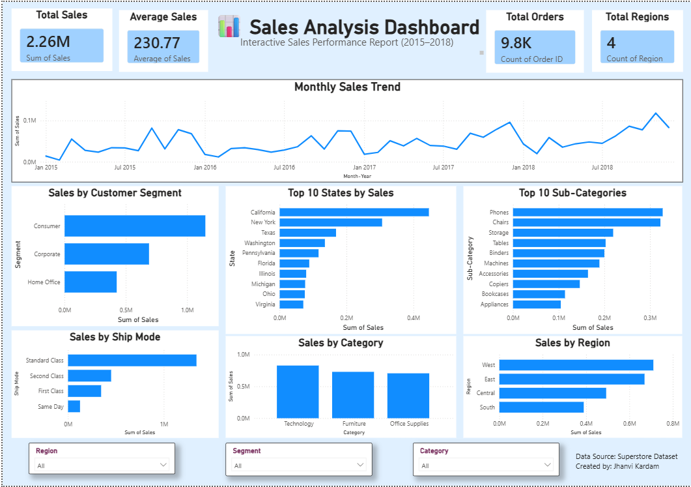

# 📊 Sales Analysis Dashboard | Power BI

An interactive Sales Analysis Dashboard built using **Power BI** to analyze sales performance across different regions, categories, customer segments, ship modes, and time periods.

---

## 📌 Project Overview

This project transforms raw Superstore sales data into an interactive dashboard that helps users understand business performance through visual analytics.

The dashboard provides insights into:

- 📈 Monthly Sales Trend
- 🌍 Sales by Region
- 🏷️ Sales by Category
- 👥 Sales by Customer Segment
- 🚚 Sales by Ship Mode
- 🏆 Top 10 States by Sales
- 📦 Top 10 Sub-Categories by Sales

---

## 🛠️ Tools & Technologies

- Power BI
- Microsoft Excel / CSV
- Data Visualization
- Business Intelligence

---

## 📂 Project Structure

```
Sales-Analysis-PowerBI/
│
├── dataset/
│   └── superstore_sales.csv
│
├── notebook/
│   ├── checkpoint.ipynb
│   └── Cleaned_Sales_Data.csv
│
├── PowerBI/
│   └── Sales_Analysis_Dashboard.pbix
│
├── Image/
│   └── dashboard.png
│
├── README.md
└── requirements.txt
```

---

## 📸 Dashboard Preview




---

# 📊 Dashboard Features

- KPI Cards
  - Total Sales
  - Average Sales
  - Total Orders
  - Total Regions

- Interactive Filters
  - Region
  - Customer Segment
  - Category

- Dynamic Charts
  - Monthly Sales Trend
  - Sales by Category
  - Sales by Region
  - Sales by Ship Mode
  - Top 10 States by Sales
  - Top 10 Sub-Categories

---

# 💡 Business Insights

### 📈 Sales Performance
- Total Sales reached **2.26 Million**.
- Average Sales per order is **230.77**.
- Total Orders processed are **9.8K**.
- Business operates across **4 Regions**.

### 🌍 Regional Analysis
- West region generated the highest sales.
- South region contributed the least revenue.

### 🏷️ Category Analysis
- Technology is the highest-selling category.
- Furniture ranks second.
- Office Supplies contributes steady sales.

### 👥 Customer Segment
- Consumer segment contributes the highest revenue.
- Corporate customers are the second-largest segment.
- Home Office contributes the least sales.

### 🚚 Ship Mode
- Standard Class is the most preferred shipping method.
- Same Day shipping has the lowest usage.

### 📦 Product Analysis
- Phones and Chairs are the highest-selling sub-categories.
- Storage and Tables also contribute significantly.

### 🗺️ State Analysis
- California generates the highest sales.
- New York and Texas follow among the top-performing states.

### 📈 Trend Analysis
- Monthly sales show a generally increasing trend over time with seasonal fluctuations.

---

## 🎯 Project Outcome

This dashboard helps business stakeholders:

- Track sales performance
- Identify high-performing regions
- Analyze customer purchasing behavior
- Compare product categories
- Make data-driven business decisions

---

## 👩‍💻 Created By

**Jhanvi Kardam**

Btech 2nd year | Aspiring Data Analyst

---

⭐ If you found this project useful, don't forget to Star the repository!
